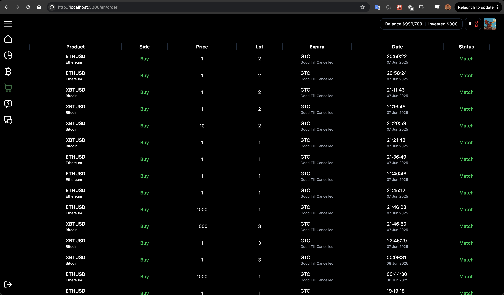

  

# Welcome to FIRE 👋

This is a fullstack trading web application I built as a personal learning project in 2025.
The goal was to design and implement a real-time trading system from scratch using Rust, Next.js, and PostgreSQL, while integrating modern features like AI, chat, and Telegram bot automation.

## 🌃 Features

- 🔐 Authentication & Login System – secure user access.
- 📈 Real-Time Order Book – synced with BitMEX market data.
- 💰 Token Trading Prototype – supports BTC, SOL, USDT, and 5 prototype tokens.
- 🤖 AI-Powered Telegram Bot – place orders directly from Telegram chat, with input sanitized using Ollama GPT before execution.
- 💬 Community Chat – powered by GetStream.io for real-time conversations.
- 🔔 Push Notifications – order status delivered via Firebase Cloud Messaging (FCM).
- ⚡ Caching with Redis – faster access for accounts and products.
- 🌐 Multi-language Support – available in /id (Bahasa Indonesia) and /en (English).
- 🌓 Dark / Light Mode – theme switcher for better UX.
- 📦 Custom Rust Crates:
    - <a href="https://github.com/crisandolindesmanrumahorbo/request-http-parser" target="_blank">HTTP request parser (path, query, body → Rust models).</a>
    - <a href="https://github.com/crisandolindesmanrumahorbo/FIRE-auth" target="_blank">HTTP client with HTTPS support (for Telegram API integration).</a>

## 🛠️ Tech Stack & Tools

Frontend:
- Nextjs
- Typescript
- Dnd sortable
- getstream.io
- next themes
- lingui
- tailwind
- zustand

Backend:
- Rust
- websocket
- jwt
- tokio
- sqlx
- request-http-server
- redis
- rumbo_client
- Ollama Gemma 3

## 📸 Demo & Screenshots

https://github.com/crisandolindesmanrumahorbo/rumbo_http_client
## Service Depedencies
1. <a href="https://github.com/crisandolindesmanrumahorbo/FIRE-auth" target="_blank">Fire Authentication</a>
2. <a href="https://github.com/crisandolindesmanrumahorbo/FIRE-order" target="_blank">Fire Order</a>
3. <a href="https://github.com/crisandolindesmanrumahorbo/FIRE-chatbot" target="_blank">Fire Chatbot</a>

## 🔧 How It Works
1. User logs into the web app.
2. Creates an order (from web OR via Telegram chat).
3. If using Telegram:
    - The bot receives the chat input.
    - Input is sanitized and structured using Ollama GPT.
    - The order is created and pushed to backend.
    -A real-time notification is sent back to the web app via FCM.
4. Users can view their portfolio, order status, and interact in community chat.

## 🎯 Learning Goals

- Deep dive into Rust backend development without heavy frameworks (no Axum/Actix, only Tokio & Serde).
- Explore real-time trading systems (order books, notifications).
- Build multi-channel integrations (Telegram + Web + AI).
- Publish & maintain Rust crates on Crates.io.

## 📍 Future Improvements

- Add real exchange API integration (beyond BitMEX order book).
- Implement advanced portfolio analytics.
- Enhance security and role-based access.
- Deploy production-ready version with CI/CD pipelines.

## BIG shoutout to:

- https://www.untitledui.com
- https://www.bitmex.com/app/wsAPI
